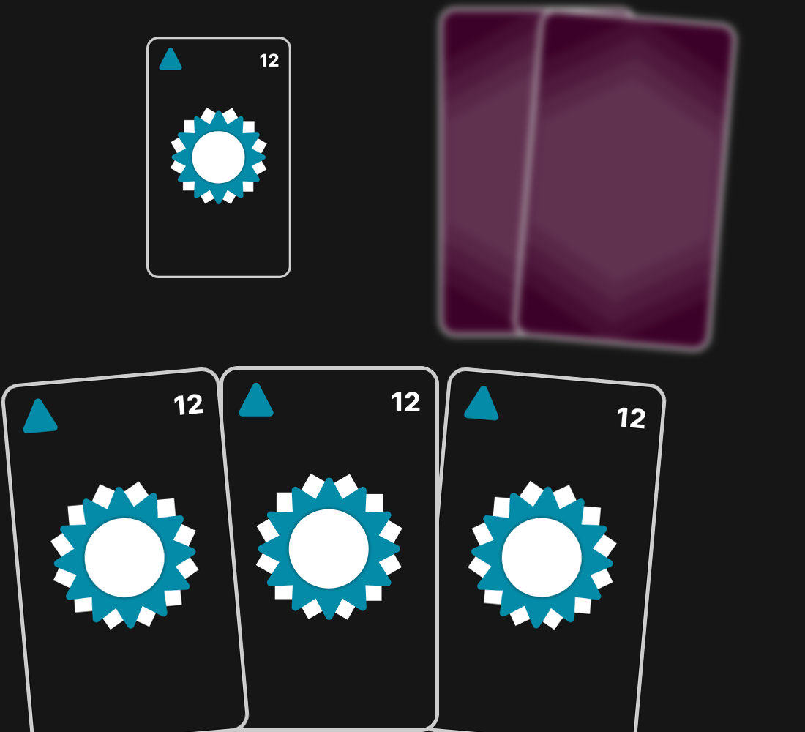
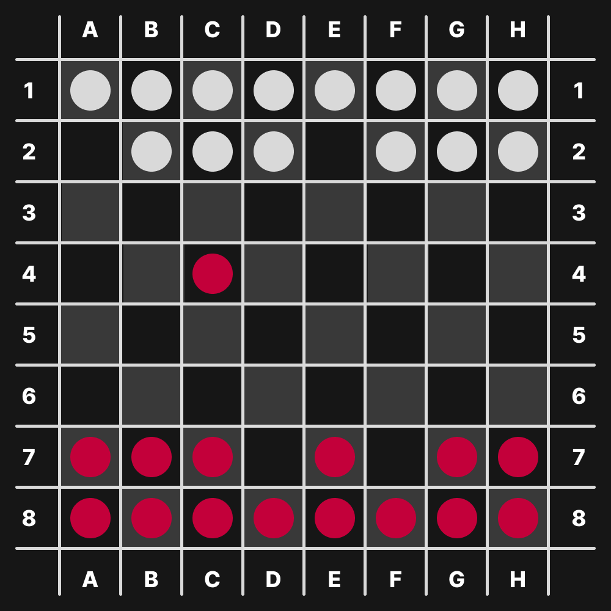

# Truco Uruguayo y Damas

En este repositorio se puede ver la lógica para generar la imágen del truco.

No se incluye el código fuente de las damas porque para generar el tablero y
testear ya aplicamos toda la lógica del juego.

## Preview Truco Uruguayo
> Para regenerar la imagen deberan de ejecutar Program.cs desde su directorio.

## Preview Damas

